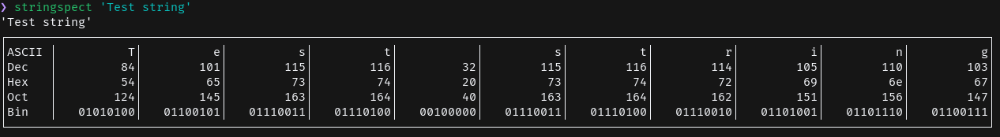

# Stringspect

This program takes a string input and displays each character in a neatly formatted table, showing its ASCII representation, decimal, hexadecimal, octal, and binary values.



## Usage

Run it with a string argument:

```bash
stringspect "Hello, World!"
```

## License

This program is licensed under the [GNU General Public License v3.0](./LICENSE).
